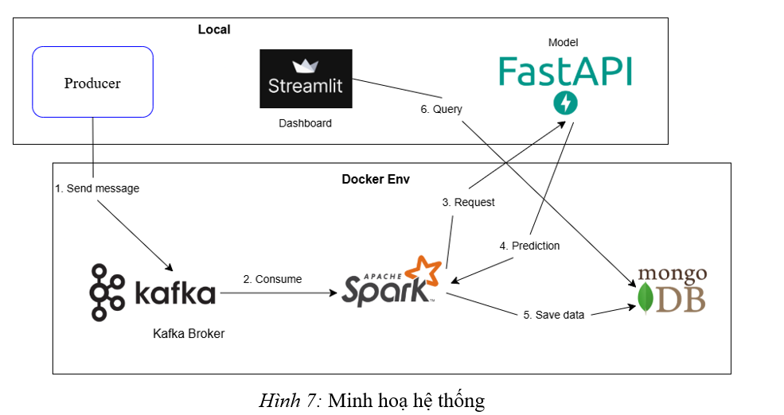
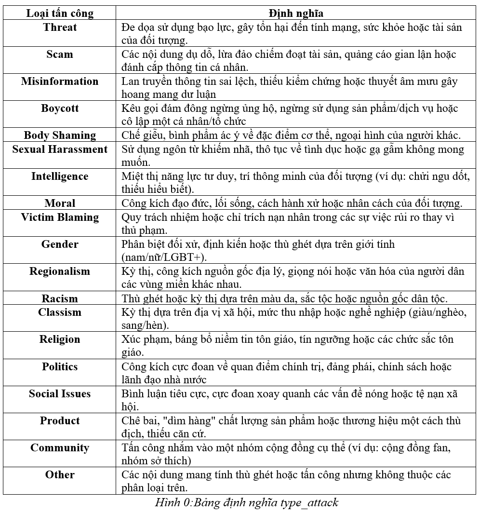
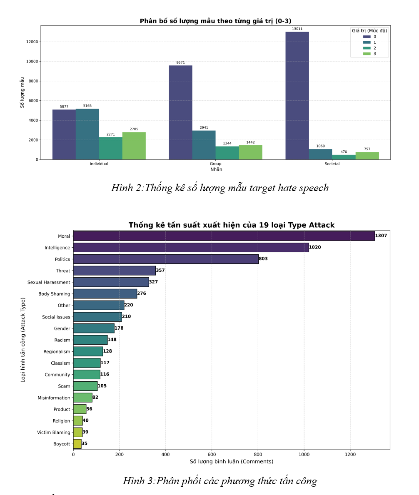

# Hate Speech Comment Detection & Real-Time Attack Topic Monitoring
 
## 1. Overview
 
This project is the final coursework for the SE363 course. It focuses on building an automated pipeline for analyzing Vietnamese social media comments in order to detect and classify discussion topics.
 
The core objective is to identify **collective attacks**, with a deep dive into classifying **19 detailed attack categories** (such as Regionalism, Body Shaming, Politics, etc.).
 
## 2. Team Information
 
* **Supervisor:** Dr. Đỗ Trọng Hợp
* **Developers:**
  * Võ Anh Quân – 22521192
  * Võ Minh Quyền – 22521227
## 3. System Architecture
 

 
The system uses a hybrid architecture designed to optimize hardware resource usage and, in particular, to avoid Out-of-Memory (OOM) errors on Spark clusters:
 
* **Data Infrastructure (Docker Environment):** Components such as the Kafka Broker, Apache Spark Streaming, and MongoDB are containerized and run via Docker Containers.
* **Model Server (FastAPI):** The deep learning model is decoupled into an independent API service built with FastAPI and run on a local server, ensuring the model is loaded into memory only once.
* **Monitoring Interface:** A Streamlit dashboard is used to display real-time alerts.
## 4. Dataset & Preprocessing
 

 
* **Dataset:** 15,298 real-world comments collected from Facebook, YouTube, and Reddit.
* **Preprocessing pipeline:**
  * Automatic Vietnamese diacritic restoration using an XLM-RoBERTa-based model (vietnamese-accent-marker).
  * Normalization of abbreviations and teencode, plus noise removal (URLs, emojis).
  * Word segmentation using the PyVi library and part-of-speech tagging using Underthesea.

 
## 5. Model Architecture
 
The system implements two deep learning architectures built on the Transformers framework:
 
1. **Multi-task Hybrid Model (PhoBERT-CNN-BiGRU):** Leverages PhoBERT's semantic understanding, extracts local features using multi-scale CNNs, and captures sequential context with a Bi-GRU. The model simultaneously classifies three dimensions: Individual, Group, and Societal.
2. **Single-task Classification Model:** Combines PhoBERT with a linear neural network to perform multi-label classification across the 19 attack categories.
## 6. Experimental Results
 
* The multi-label Type Attack model achieves a very low Hamming Loss (0.0613) and an optimal F1-Micro score of 0.6011 at a 0.3 threshold.
* The hybrid architecture significantly outperforms traditional machine learning methods (e.g., SVM combined with TF-IDF) in handling noisy language and understanding Vietnamese context.
---
 
## 7. Installation & Usage
 
### Prerequisites
 
* Docker & Docker Compose
* Python 3.8+
### Getting Started
 
**Step 1 — Start the data infrastructure (Kafka, Spark, MongoDB)**
 
```bash
# Navigate to the directory containing docker-compose.yml
docker-compose up -d
```
 
**Step 2 — Start the Model Server (FastAPI)**
 
```bash
# Open a new terminal and activate your virtual environment
pip install -r requirements.txt
 
# Run the FastAPI server
uvicorn main:app --host 0.0.0.0 --port 8000
```
 
**Step 3 — Launch the Monitoring Dashboard (Streamlit)**
 
```bash
# Open a new terminal
streamlit run dashboard.py
```
 
---
 
## 8. Repository
 
Source code: [anhquanabczy/Hate-speech-livestream-detec-using-bigdata](https://github.com/anhquanabczy/Hate-speech-livestream-detec-using-bigdata)
